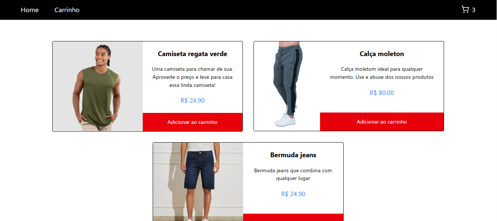

# Ecommerce Products




> Ecommerce de produtos com gerenciamento dos estados de carrinho e produtos em Context API

<br>

## 📋 Pré-requisitos

[NodeJS](https://nodejs.org/pt) - Ambiente de execução JavaScript no lado do servidor, que permite criar aplicações rápidas e escaláveis

<br>

## 🛠️ Construído com
* [React](https://pt-br.react.dev/) - Biblioteca JavaScript para construção de interfaces de usuário interativas e dinâmicas;
* [TypeScript](https://www.typescriptlang.org/) - Linguagem que adiciona tipagem estática ao JavaScript;
* [Tailwind](https://tailwindcss.com/) - Framework CSS baseado em utilitários para estilizar rapidamente;
* [Fetch API](https://developer.mozilla.org/en-US/docs/Web/API/Fetch_API) - Interface JavaScript que permite realizar requisições HTTP assíncronas para obter ou enviar dados de/para um servidor;
* [Lucide](https://lucide.dev/) - Coleção de ícones open-source para projetos web;
<br>

## ⚙️ Executando o projeto

```
git clone https://github.com/maxsueldev/Ecommerce-Products.git
```

* Abra a raiz do projeto e execute: 

```
npm install
```

* E em seguida: 

```
npm run server
npm run dev
```
